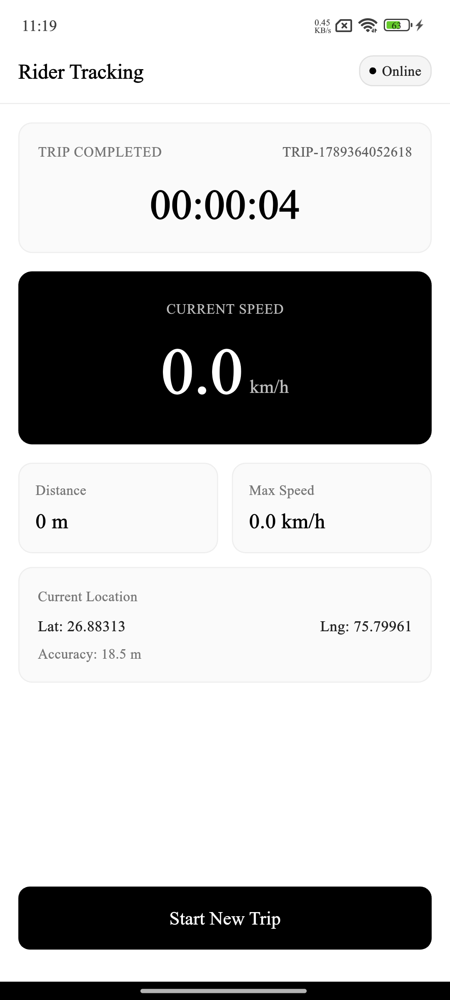
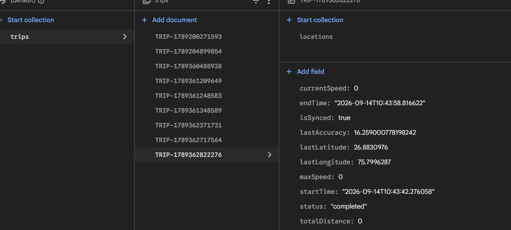

# Rider Tracking App — Mobile Application

In this app i used Flutter with Provider State Management for frontend and use Firebase Firestore as DB.
for local storage i use shared peferences package to store every data about the trip at the local if trip is started and at the ending sync my local db and cloud db for working fine.

---

## Visuals & Firebase Database Screenshots

The `assets/screenshots/` directory contains visual proof of the application interface, the Firebase Cloud Firestore database schema, and live stored trips:

### 1. App Interface & Rider Dashboard
The clean, high-contrast monochrome UI designed for outdoor visibility:


### 2. Firebase Cloud Firestore — `trips` Collection
Showing multiple completed and in-progress trips stored directly in Firestore:


### 3. Trip Document Details
Showing multiple completed and in-progress trips stored directly in Firestore and
trip metadata, distance, duration, current speed, max speed, and sync status:



---

## Firebase Cloud Firestore Architecture

The application communicates with Firebase Cloud Firestore using the official `cloud_firestore` SDK. Data is structured hierarchically into a root `trips` collection with nested `locations` subcollections.

### 1. Root Collection: `trips`
Each trip is stored as a document with the document ID matching the `tripId` (e.g. `trips/TRIP-1789204899854`).

| Field | Type | Description | Example |
|---|---|---|---|
| `tripId` | `String` | Unique trip identifier | `"TRIP-1789204899854"` |
| `startTime` | `String` (ISO 8601) | Timestamp when trip started | `"2026-09-08T10:15:23.000Z"` |
| `endTime` | `String?` (ISO 8601) | Timestamp when trip ended (null if active) | `"2026-09-08T10:35:10.000Z"` |
| `status` | `String` | Current trip state (`active`, `completed`) | `"completed"` |
| `totalDistance` | `Number` (meters) | Total validated distance travelled | `4250.8` |
| `currentSpeed` | `Number` (km/h) | Rider's current speed | `38.5` |
| `maxSpeed` | `Number` (km/h) | Highest valid speed recorded during trip | `54.2` |
| `lastLatitude` | `Number` | Last recorded latitude | `28.6139` |
| `lastLongitude` | `Number` | Last recorded longitude | `77.2090` |
| `lastAccuracy` | `Number` | Last recorded horizontal accuracy in meters | `6.5` |
| `isSynced` | `Boolean` | Sync status flag | `true` |

### 2. Nested Subcollection: `trips/{tripId}/locations`
Every validated location update during an active trip is stored under this subcollection. The document ID is the point's millisecond timestamp (e.g. `locations/1789204899950`).

```json
{
  "tripId": "TRIP-1001",
  "latitude": 28.6139,
  "longitude": 77.2090,
  "speed": 42.5,
  "accuracy": 8.2,
  "timestamp": "2026-09-08T10:15:23.000Z"
}
```

### 3. Firestore Security Rules
To allow the mobile app to write trip data without requiring a user login screen, the following Firestore rules are applied:

```javascript
rules_version = '2';

service cloud.firestore {
  match /databases/{database}/documents {
    match /{document=**} {
      allow read, write: if true;
    }
  }
}
```

---

## Project Structure

```
lib/
├── main.dart                      # App entry point, Firebase init & MultiProvider setup
├── models/                        #Data Models
│   ├── location_point.dart       
│   └── trip_model.dart            
├── providers/                     # State management Controller
│   └── trip_provider.dart        
├── services/                      # Package Releated Serives 
│   ├── connectivity_service.dart  
│   ├── firebase_service.dart     
│   ├── gps_filter_service.dart    
│   ├── location_service.dart     
│   └── storage_service.dart       
└── ui/                            # UI Presentation Layer
    └── trip_screen.dart           
assets/                            # App Assets
└── screenshots/                  
```

---

## Setup & Run Instructions

### Prerequisites
- Flutter SDK (3.24.0 or above)
- Android Studio

### 1. Install Dependencies
```bash
flutter pub get
```

### 2. Run the App
```bash
flutter run
```

